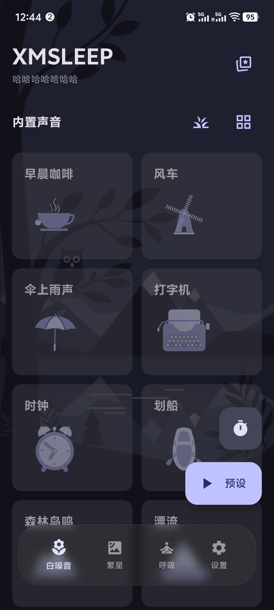
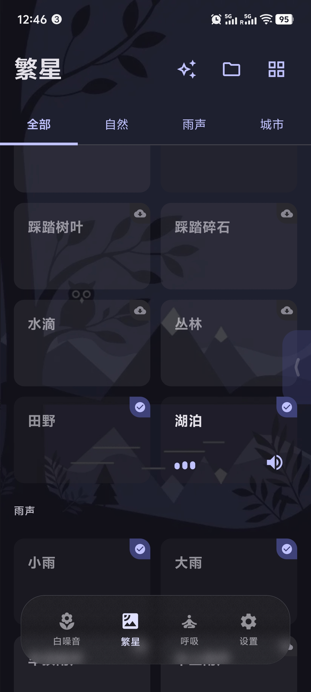
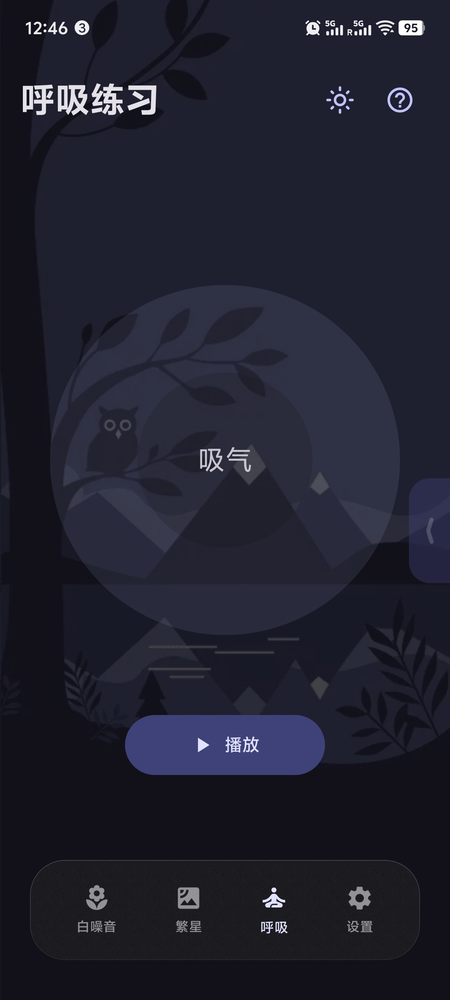
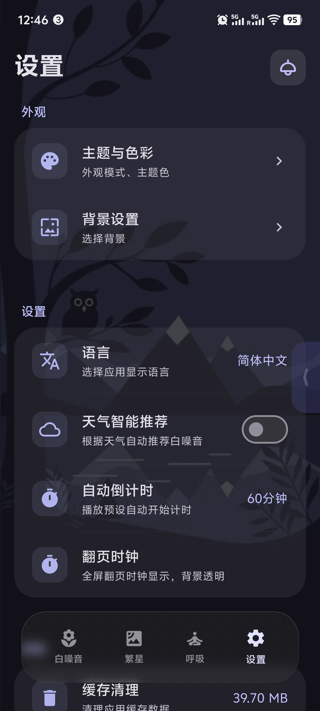
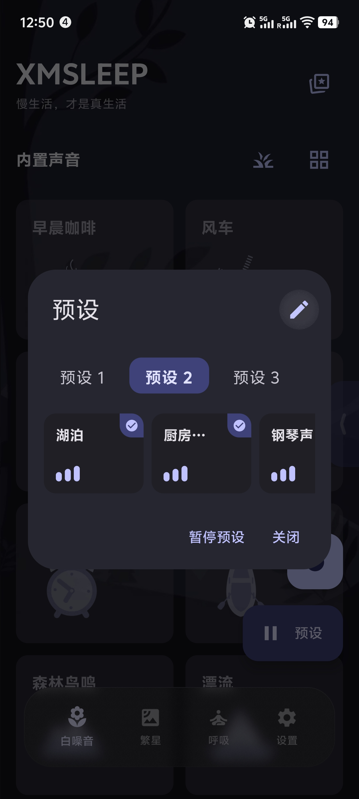
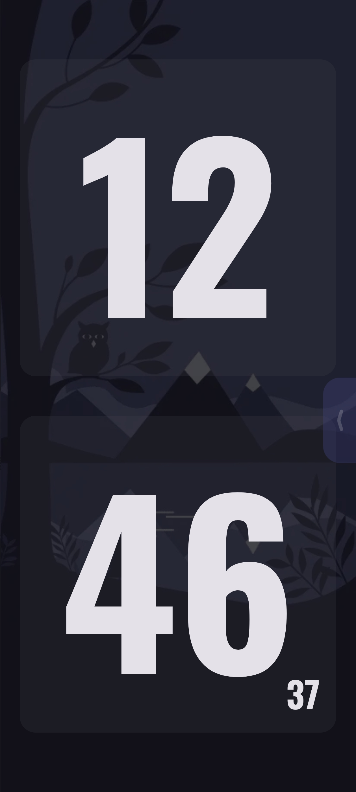

 <h1 align="center"> 📱 XMSLEEP
  </h1>

<div align="center">

백색 소음 및 자연 소리 재생을 위한 Android 앱으로, 휴식과 집중, 수면을 도와줍니다.

[](LICENSE)
[](https://kotlinlang.org/)
[](https://www.android.com/)

[다운로드](#다운로드) • [기능](#기능) • [사용법](#사용법)

**Language**: [中文](README.md) | [繁體中文](README_ZH_TW.md) | [English](README_EN.md) | 한국어 | [Русский](README_RU.md) | [日本語](README_JA.md)

<a href="https://hellogithub.com/repository/Tosencen/XMSLEEP" target="_blank"></a>
</div>

## 📱 스크린샷

<div align="center">

<table>
  <tr>
    <td align="center">
      <a href="screenshots/1.jpg"></a>
    </td>
    <td align="center">
      <a href="screenshots/2.jpg"></a>
    </td>
    <td align="center">
      <a href="screenshots/3.jpg"></a>
    </td>
  </tr>
  <tr>
    <td align="center">
      <a href="screenshots/4.jpg"></a>
    </td>
    <td align="center">
      <a href="screenshots/5.jpg"></a>
    </td>
    <td align="center">
      <a href="screenshots/6.jpg"></a>
    </td>
  </tr>
</table>

</div>

---

## 📱 소개

XMSLEEP은 백색 소음 및 자연 소리 재생에 특화된 Android 앱으로, 다양한 자연 소리를 제공하여 휴식, 집중, 수면을 도와줍니다. Material Design 3 디자인 가이드라인을 적용하여 깔끔하고 아름다운 인터페이스를 제공합니다.

## ✨ 기능

### 🎵 오디오 기능
- **다양한 백색 소음**: 빗소리, 모닥불, 천둥, 고양이 가르릉, 새소리, 밤곤충 등 다양한 자연 소리 제공
- **온라인 오디오**: GitHub에서 더 많은 오디오 리소스를 동적으로 로드
- **로컬 오디오**: 휴대폰의 오디오 파일 재생 지원
- **끊김 없는 루프**: 오디오 끊김 없이 반복 재생 지원
- **볼륨 제어**: 각 사운드별 개별 볼륨 조절 또는 한 번에 모든 사운드 조절
- **볼륨 저장**: 볼륨 설정이 앱 재시작 후에도 자동으로 유지됨
- **블루투스 헤드셋 지원**: 블루투스 헤드셋 연결 해제 시 자동 재생 중지

### 🎨 인터페이스 및 경험
- **아름다운 애니메이션**: 내장 사운드에 WebP 애니메이션 제공
- **Material Design 3**: 최신 Material Design 3 디자인 가이드라인 적용
- **테마 전환**: 라이트/다크 모드 전환, 시스템 테마 자동 적용
- **커스텀 테마**: 다양한 색상 테마 및 동적 색상 지원

### ⚙️ 실용 기능
- **타이머 기능**: 자동 재생 중지 시간 설정
- **프리셋 영역**: 3개의 프리셋, 각 프리셋마다 최대 10개의 즐겨찾는 사운드 저장
- **즐겨찾기**: 좋아하는 백색 소음 저장
- **최근 재생**: 앱 재시작 시 최근 재생 목록 표시
- **전역 플로팅 버튼**: 현재 재생 중인 사운드 표시, 빠른 일시정지 및 확장
- **스마트 상호작용**: 플로팅 버튼과 프리셋 창이 상호 배타적, 스크롤 시 자동 숨김
- **자동 업데이트**: GitHub Releases를 통한 업데이트 확인, 다운로드 상태 유지

## 🛠️ 기술 스택

- **Kotlin** - 주요 개발 언어
- **Jetpack Compose** - 최신 UI 프레임워크
- **Material Design 3** - UI 디자인 시스템
- **ExoPlayer/Media3** - 오디오 재생 엔진
- **OkHttp** - 네트워크 요청 및 파일 다운로드
- **Gson** - JSON 파싱
- **Kotlinx Serialization** - JSON 직렬화
- **Coil** - 이미지 로딩
- **WebP** - 애니메이션 지원
- **MaterialKolor** - 동적 테마 색상 생성
- **Accompanist** - Pull-to-refresh 지원

## 📦 현재 버전

- **버전**: 2.2.3
- **Version Code**: 38
- **최소 지원**: Android 8.0 (API 26)
- **대상 버전**: Android 15 (API 35)

### 🆕 최신 업데이트 (v2.2.3)

#### 🎨 새 기능
- **명언 위젯**: 시간, 일일 명언, 새로고침 버튼을 표시하는 홈 화면 위젯 추가

### 이전 버전

#### v2.2.1
- **호흡 운동**: 호흡 가이드 기능 추가
- **화면 켜짐 유지**: 화면 켜짐 설정 최적화
- **날씨 오디오 매핑**: 날씨와 오디오 매핑 개선

## 🚀 다운로드

최신 버전은 [GitHub Releases](https://github.com/Tosencen/XMSLEEP/releases)에서 다운로드할 수 있습니다.

## 📋 빌드 요구사항

- **Android Studio**: Hedgehog | 2023.1.1 이상
- **JDK**: 17 이상
- **Android SDK**: API 33 이상
- **Gradle**: 8.0 이상

## 🔨 빌드 방법

1. **저장소 클론**
   ```bash
   git clone https://github.com/Tosencen/XMSLEEP.git
   cd XMSLEEP
   ```

2. **Gradle 설정**
   - `gradle.properties.example`를 `gradle.properties`로 복사
   - (선택) GitHub Token 설정하여 API 제한 완화

3. **프로젝트 열기**
   - Android Studio로 프로젝트 열기
   - Gradle 의존성 동기화

4. **프로젝트 실행**
   - 기기 연결 또는 에뮬레이터 실행
   - 실행 버튼 클릭

## 📖 사용법

### 기본 조작
1. **사운드 재생**: 사운드 카드를 탭하여 재생, 다시 탭하여 중지
2. **볼륨 조절**: 카드 우측 하단의 볼륨 아이콘을 탭하여 각 사운드별 볼륨 조절
3. **타이머 설정**: 우측 하단의 타이머 버튼으로 자동 중지 시간 설정

### 인터페이스 조작
4. **테마 전환**: 좌측 상단의 테마 전환 버튼으로 라이트/다크 모드 전환
5. **커스텀 설정**: 설정 페이지에서 테마 색상, 애니메이션 숨김 등 조정
6. **프리셋 관리**: 사운드 카드 제목 탭 후 "프리셋에 추가" 선택
7. **프리셋 전환**: 하단 프리셋 영역에서 3개 프리셋 전환
8. **즐겨찾기**: 사운드 카드 제목 탭 후 "즐겨찾기" 선택

### 고급 기능
9. **전역 플로팅 버튼**: 사운드 재생 중 플로팅 버튼 표시, 탭하여 재생 목록 확인
10. **프리셋 일괄 추가**: 플로팅 버튼 확장 상태에서 재생 중인 사운드를 프리셋에 일괄 추가
11. **스마트 숨김**: 스크롤 또는 탭 전환 시 플로팅 버튼 자동 숨김

## ⚠️ 사운드 출처

- **내장 사운드**: 오픈소스 오디오 라이브러리
- **온라인 사운드**: [moodist](https://github.com/remvze/moodist) 프로젝트 (MIT 라이선스)
- **타사 리소스**: 일부 사운드는 타사 제공업체에서 제공, 해당 라이선스 적용
  - **Pixabay Content License** 사운드: [Pixabay Content License](https://pixabay.com/service/license-summary/)
  - **CC0** 사운드: [Creative Commons Zero License](https://creativecommons.org/publicdomain/zero/1.0/)

## 📄 라이선스

이 프로젝트는 [MIT License](LICENSE)를 따릅니다.

## 🤝 기여

Issue 및 Pull Request를 환영합니다!

### 기여 가이드
1. 이 저장소를 Fork
2. 기능 브랜치 생성 (`git checkout -b feature/AmazingFeature`)
3. 변경사항 커밋 (`git commit -m 'Add some AmazingFeature'`)
4. 브랜치에 푸시 (`git push origin feature/AmazingFeature`)
5. Pull Request 열기

## 👤 만든 이

**Tosencen**

- GitHub: [@Tosencen](https://github.com/Tosencen)

## 🙏 감사의 말

- [moodist](https://github.com/remvze/moodist) - 온라인 오디오 리소스
- [Material Design 3](https://m3.material.io/) - UI 디자인 가이드라인
- [MaterialKolor](https://github.com/material-foundation/material-color-utilities) - 동적 색상 생성

---

<div align="center">

**⭐ 이 프로젝트가 도움이 되셨다면 Star를 눌러주세요!**

© 2026 XMSLEEP. All rights reserved.

</div>
